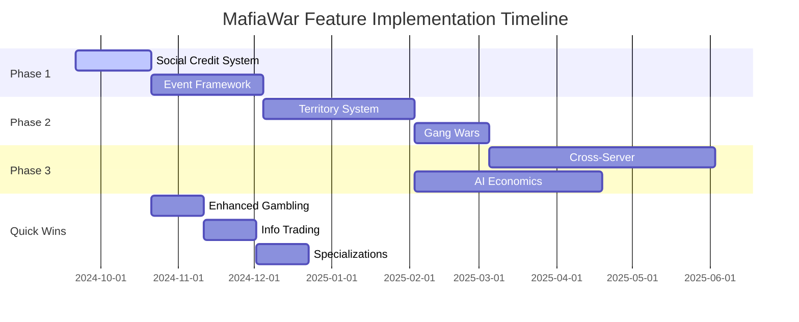

# MafiaWar Feature Implementation Roadmap

## Phase 1: Foundation Enhancement (Month 1-2)

### Priority 1: Social Credit System
**Effort:** Low | **Impact:** High | **Risk:** Low

```typescript
// Extend existing user schema
interface SocialCredit {
  userId: string;
  totalCredits: number;
  reputationLevel: string;
  influenceTokens: number;
  favorBalance: number;
  lastInteraction: Date;
}
```

**Implementation Steps:**
1. Add social credit tracking to database schema
2. Implement credit earning through existing commands  
3. Add influence modifiers to crime success rates
4. Create favor trading system using existing economy

### Priority 2: Seasonal Event Framework
**Effort:** Medium | **Impact:** High | **Risk:** Medium

```typescript
interface SeasonalEvent {
  id: string;
  name: string;
  type: 'heist' | 'tournament' | 'market' | 'territory';
  startDate: Date;
  endDate: Date;
  participants: string[];
  rewards: EventReward[];
  status: 'upcoming' | 'active' | 'completed';
}
```

**Implementation Steps:**
1. Create event management system
2. Build on existing crime mechanics for event crimes
3. Add temporary leaderboards and achievements
4. Implement event-specific rewards distribution

---

## Phase 2: Territory Control (Month 2-3)

### Priority 1: Basic Territory System
**Effort:** High | **Impact:** High | **Risk:** Medium

```
Territory Map (ASCII representation in Discord):
🏦 Financial   🏭 Industrial  🏘️ Residential
🔧 Tech        ⚫ Underground  🎭 Entertainment
🚢 Harbor      🏛️ Government  🌳 Suburbs
🏪 Commercial  🎓 University   🏥 Medical
```

**Implementation Steps:**
1. Create territory ownership tracking
2. Implement basic attack/defense mechanics
3. Add territory-specific benefits to existing systems
4. Create visual territory status displays

### Priority 2: Gang Territory Wars
**Effort:** Medium | **Impact:** High | **Risk:** Low

**Implementation Steps:**
1. Extend existing gang system with territory features
2. Add gang vs gang battle calculations
3. Implement territory income distribution
4. Create territory war notifications

---

## Phase 3: Advanced Features (Month 3-6)

### Cross-Server Networking
**Effort:** Very High | **Impact:** Very High | **Risk:** High

**Technical Requirements:**
- Multi-server database architecture
- Secure cross-server communication
- Global player identity system
- Network-wide event coordination

### AI Economic Events
**Effort:** High | **Impact:** Medium | **Risk:** Medium

**Implementation Approach:**
1. Start with rule-based economic triggers
2. Analyze existing player behavior patterns
3. Implement dynamic event generation
4. Gradually add machine learning components

---

## Quick Win Features (Can be implemented alongside major features)

### 1. Enhanced Gambling System
```typescript
// Extend existing casino with tournaments
interface PokerTournament {
  id: string;
  entryFee: number;
  prizePool: number;
  participants: string[];
  status: 'registering' | 'active' | 'completed';
  startTime: Date;
}
```

### 2. Information Trading System
```typescript
interface Intelligence {
  id: string;
  type: 'asset_info' | 'gang_plans' | 'crime_tips';
  target: string;
  seller: string;
  price: number;
  reliability: number; // 0-100% accuracy
}
```

### 3. Character Specialization Paths
```typescript
interface Specialization {
  type: 'tech' | 'violence' | 'economic' | 'political';
  level: number;
  bonuses: SpecializationBonus[];
  requirements: SpecializationReq[];
}
```

---

## Implementation Timeline



---

## Risk Assessment & Mitigation

### High-Risk Items
1. **Cross-Server Networking**
   - Risk: Data inconsistency, security vulnerabilities
   - Mitigation: Extensive testing, gradual rollout, fallback systems

2. **AI Economic Events**
   - Risk: Unbalanced economy, unpredictable behaviors
   - Mitigation: Start simple, extensive monitoring, manual override capabilities

3. **Real-Time Territory Battles**
   - Risk: Discord API rate limits, performance issues
   - Mitigation: Efficient caching, batch operations, optimized notifications

### Medium-Risk Items
1. **Event Framework**
   - Risk: Player adoption, complexity management
   - Mitigation: Start with simple events, clear tutorials, opt-in participation

2. **Territory Control**
   - Risk: Gang balance issues, griefing potential
   - Mitigation: Cooldown systems, protection mechanics, admin tools

---

## Success Metrics by Phase

### Phase 1 Targets
- Social Credit System: 70% of active players earn credits within 2 weeks
- Event Framework: 50% participation in first seasonal event

### Phase 2 Targets  
- Territory Control: 80% of active gangs participate in territory battles
- Gang Wars: Average 3 territory battles per day across all servers

### Phase 3 Targets
- Cross-Server: 25% of players interact across servers within first month
- AI Events: 2-3 dynamic events per week with 60% player engagement

---

## Resource Requirements

### Development Team
- **Lead Developer**: Overall architecture and complex features
- **Backend Developer**: Database design and API development
- **Frontend Developer**: Discord interface and user experience
- **Game Designer**: Balance testing and content creation

### Infrastructure
- **Database**: Upgraded hosting for multi-server support
- **Monitoring**: Performance tracking and economic analysis tools
- **Testing**: Separate test environments for each major feature
- **Documentation**: Comprehensive guides for new features

---

## Backward Compatibility Strategy

All new features must maintain full compatibility with existing gameplay:

1. **Opt-in Participation**: Players can continue using existing features without engaging new systems
2. **Incremental Enhancement**: New features enhance rather than replace existing mechanics
3. **Graceful Degradation**: System continues functioning if new features encounter issues
4. **Migration Tools**: Smooth transition paths for players adopting new features

---

This roadmap provides a structured approach to implementing the proposed features while minimizing risks and ensuring successful adoption by the MafiaWar community.